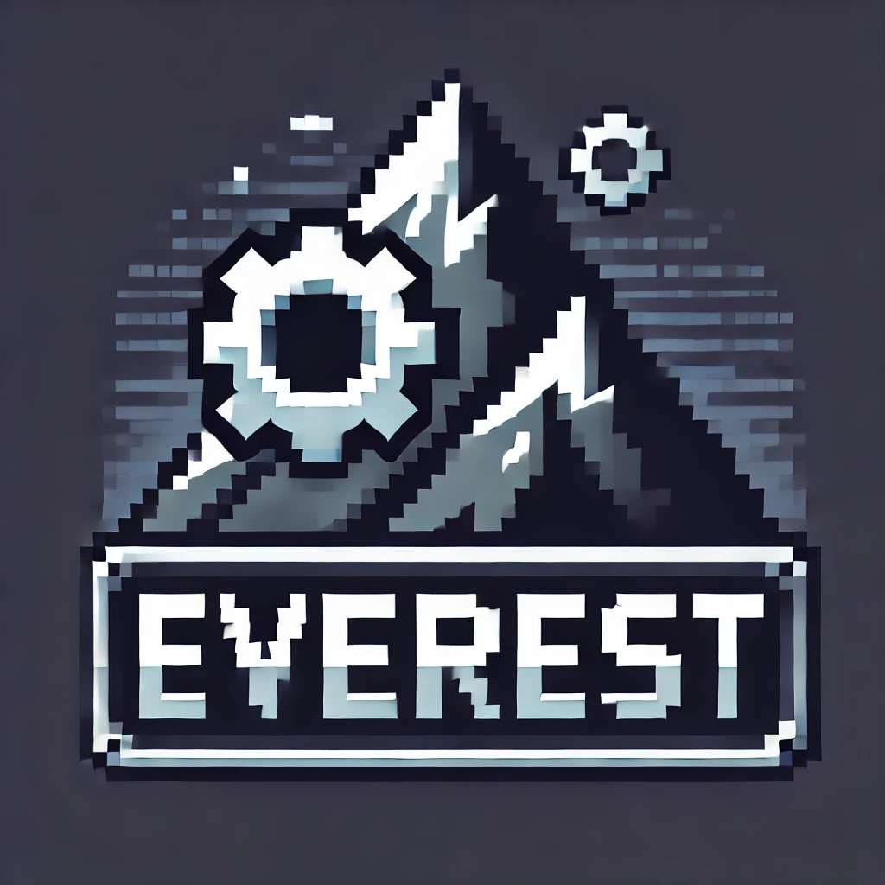

# Everest Engine

    

## High performance Cross-Platform Game Engine

__[Everest Engine](https://sunxsapk.github.io/everest)__ is a cross platform game engine, which enables
you to create games via an easy-to-use interface. It provides a comprehensive set of tools for you to
create games without any hassle. It enables you to create games for major Desktop Platforms (Windows,
Linux) as of now.

## Getting the Engine

### Installers
Installers for major platforms are provided [here](https://github.com/sunxsapk/everest/releases), which
you can download and run to get things up and running on your machine.

### Building from source
If you want to develop the engine from source code, then it is also viable. Simply follow the instructions
[here](/docs/Build.md).

## Documents

1. [Build form Source](/docs/Build.md).
2. [Lua Scripting API](/docs/ScriptingAPI.md)
3. [Programming API](/docs/ProgrammingAPI.md)

